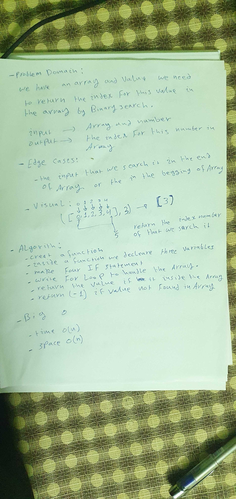
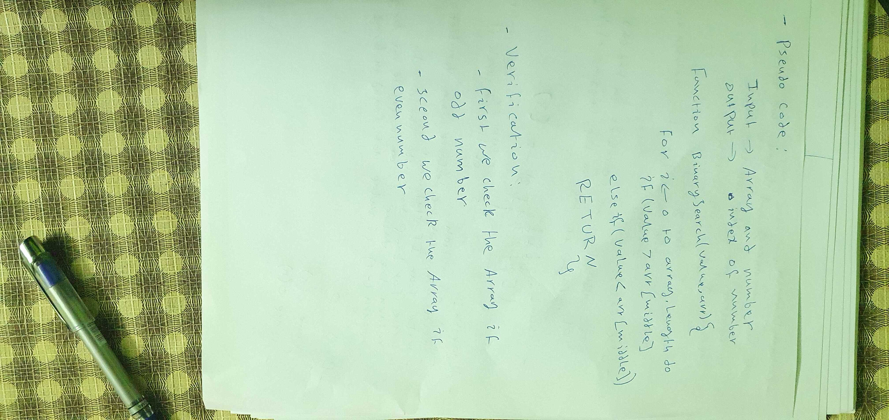
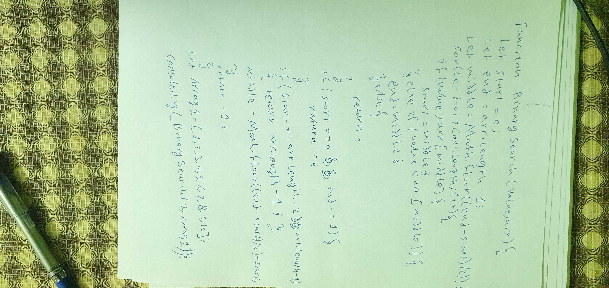

# Binary Search of Sorted Array

**function takes in 2 parameters: a sorted array and the search key. Without utilizing any of the built-in methods available to your language.**

## Whiteboard Process

## Approach & Efficiency

**What approach did you take?**

*we learn CRUD and REST*

