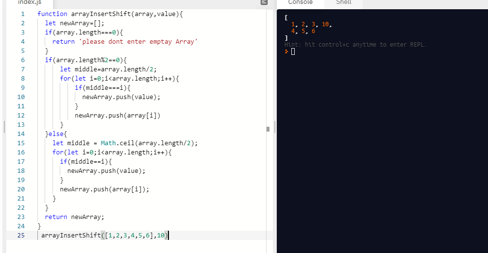
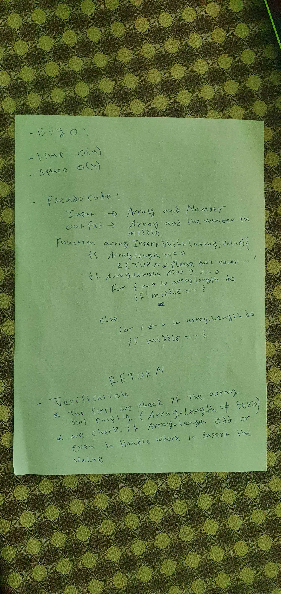
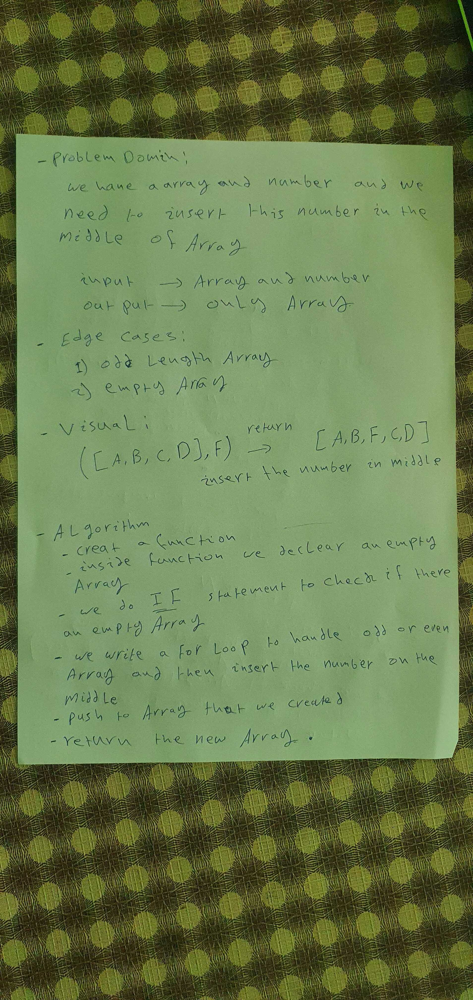

# Insert to Middle of an Array

**the code takes in an array and a value to be added. Without utilizing any of the built-in methods available to your language, return an array with the new value added at the middle index.**

## Whiteboard Process

## Approach & Efficiency

- ***What approach did you take? Discuss Why.***

*read code_challenge much time and try to think about the solution and I divide the problem into parts and after I solved the code I combine it again*

