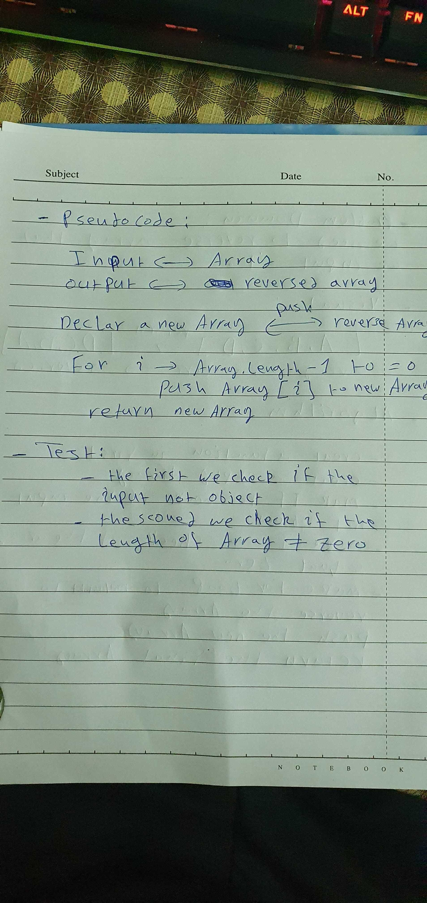
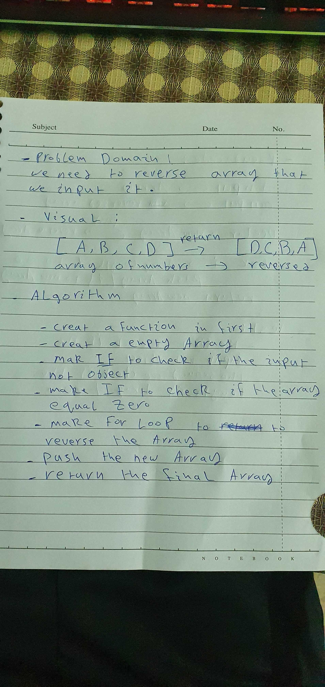
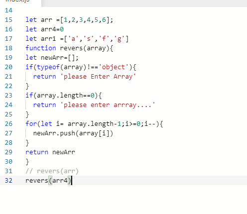

# Reverse an Array

## Whiteboard Process

## Approach & Efficiency

 What approach did you take? Discuss Why.
we ues if statement and for loop to reverse array 

  What is the Big O space/time for this approach? 