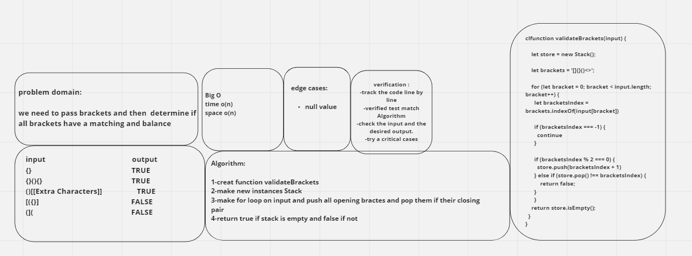

### Stacks and Queues   

***A stack is a data structure that consists of nodes. Each node references the next node in stack but not reference to it’s previous.***

### API

**push():** *the method used to put nodes or items to the stack*
**pop():** *the method used to remove nodes or items from the stack you can’t pop an empty stack*
**top():** *it’s the top of the stack*
**peek():** *When you peek you will view the value of the top Node in the stack. When you attempt to peek an empty stack an exception will be raised.*

**Animal Shelter**
***Enqueue - Nodes or items that are added to the queue.***

***Dequeue - Nodes or items that are removed from the queue. If called when the queue is empty an exception will be raised.***

