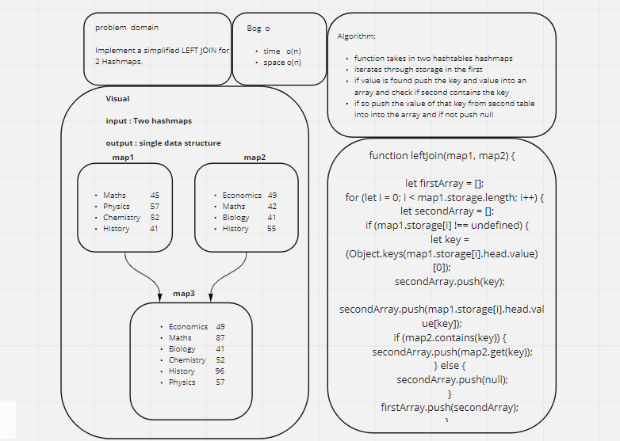

# Hashtables

 *computing, a hash table (hash map) is a data structure that implements an associative array abstract data type, a structure that can map keys to values. A hash table uses a hash function to compute an index, also called a hash code, into an array of buckets or slots, from which the desired value can be found. During lookup, the key is hashed and the resulting hash indicates where the corresponding value is stored.*

## Challenge

- **Write a function that LEFT JOINs two hashmaps into a single data structure.**
- **The first parameter is a hashmap that has word strings as keys, and a synonym of the key as values.**
- **The second parameter is a hashmap that has word strings as keys, and antonyms of the key as values.**
- **Combine the key and corresponding values (if they exist) into a new data structure according to LEFT JOIN logic.**
- **LEFT JOIN means all the values in the first hashmap are returned, and if values exist in the “right” hashmap, they are appended to the result row. If no values exist in the right hashmap, then some flavor of NULL should be appended to the result row.**
- **The returned data structure that holds the results is up to you. It doesn’t need to exactly match the output below, so long as it achieves the LEFT JOIN logic.**
- **Avoid utilizing any of the library methods available to your language.**

### Approach & Efficiency

- *Function takes in two hashtables/hashmaps.*
- *Iterates through buckets in the first.*
- *If value is found, push the key and value into an array and check if second contains the key.*
- *If so, push the value of that key from the second table into the array and if not push null.*

### UML

  