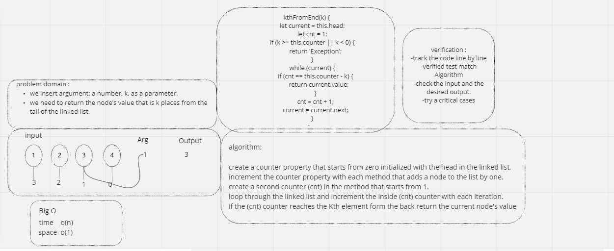

# Singly Linked List

**List of nodes that are linked to each other in a linear fashion each node referenes the next node in the link**

## Challenge

**when we need how find the last value**

## Approach & Efficiency

**What approach did you take?**

**insertAfter(),insertBefore(),append**

*write the code first by ***whiel loop*** and then go and make the test*

*big O of time o(n)*

*big O of space o(1)*
 
*create linked list to return value from the end*

### whiteboard Process

