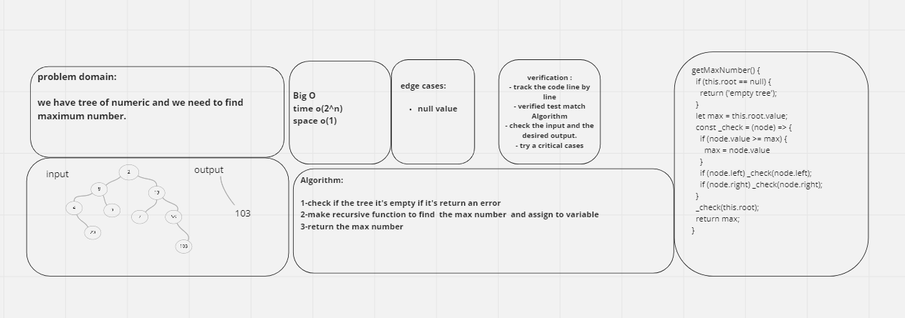

# Trees

**Tree data structures have many uses, and it’s good to have a basic understanding of how they work. Trees are the basis for other very used data structures like Maps and Sets. Also, they are used on databases to perform quick searches. The HTML DOM uses a tree data structure to represents the hierarchy of elements.**

## Challenge

**first time  to deal with tree**

## API

- **Pre-order:** *Root –> Left –> Right*

- **In-order:** *Left –> Root –> Right*

- **Post-order:** *Left –> Right –> Root*

